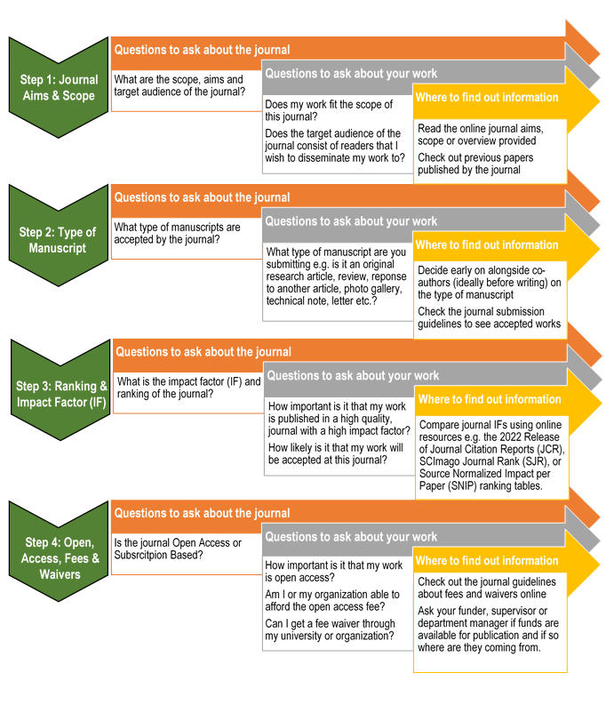

```{r setup, include=FALSE}
knitr::opts_chunk$set(echo = TRUE)
```

### 1. Introduction to Peer Review and Publication

Effective dissemination and communication of scientific aims, methodology and results is a crucial component of research. Publishing research findings facilitates idea development and sharing within the scientific community and to a wider wildlife audience, including landowners, conservationists and key decision makers keen to implement new research and concepts in practical ways. Much of the published research available in journals in print and online has been through the ‘peer review’ process, where a draft of the manuscript proceeds through several rounds of reviews by at least one, usually anonymous, academic research peer specializing in that particular research field (Bornmann, 2011). In theory, this ensures that all peer-reviewed published research is of a high quality, has been thoroughly proof-checked and is being seen by the most appropriate and wide reaching audience possible. Nevertheless, the process of publishing and reviewing scientific research is often daunting to students and early career researchers, and there is relatively little cohesive advice or guidelines about the process, often leaving such individuals to ‘figure it out for themselves’. In this section, we aim to provide a short overview of the process, both for authors and peer-reviewers, to eliminate some of the confusion and mystery about the publication of academic research. 

### 2. Determining coauthorship

One key thing to decide before beginning the manuscript submission process is who should be listed as an author of the paper (Allen et al., 2014; Rahman et al., 2017). Scientific work is rarely conducted alone, and successful, meaningful ecological research often involves large collaborative efforts between teams of researchers, conservationists, land-owners, companies, technicians and students. Thus, determining who qualifies to be listed as a co-author is not always straight-forward. Generally speaking, an un-written rule is that an individual should be listed as a co-author if they contribute to at least two crucial components of the work, which may include but are not limited to: initial study design and conceptualization, obtaining funding, project management, field or laboratory work, data collating and processing, statistical analysis and manuscript drafting or proof-reading (Rahman et al., 2017). More often now journals require an ‘Author Contribution’ statement to be added to the manuscript or the online submission form, indicating the contribution of each author to the key tasks involved in compiling the manuscript (Rennie et al., 2000) (see Box 1 for an example author contribution statement).

Another potentially controversial and confusing decision when submitting multi-authored manuscripts is in what order should the authors appear in the author list (Tscharntke et al., 2007). The first author position, receiving the most credit for the work, is generally the individual who has played the most crucial role in the work (e.g. the project lead or primary writer), with all subsequent authors listed either in order of decreasing contribution, alphabetically or in order of seniority. In some scientific fields or for particular journals, the last author position is seen as prestigiously equal to first author position and is reserved for the team leader e.g. the project manager or research principal investigator. It is important to check if the chosen journal has specific instructions about authorship contributions and order to ensure that each individual receives the appropriate credit for their work on that research project.

<center>
 

</center>
The final decision to make is who acts as the corresponding author (e.g. the individual who submits the final manuscript draft and is responsible for handling all correspondence with the journal and editors). Usually this is the first (or last if appropriate) author of the paper, and is the person responsible for handling all queries, revisions and approving article proofs from the journal. The corresponding author is also committed to declaring on behalf of all co-authors that there are no conflict of interests or prior publications of the work, and that all work is original and was conducted ethically (Shewan and Coats, 2010).


### 3. Choosing the best publication outlet

Once a draft of the manuscript has been completed and authorship has been decided, there is relatively little formal guidance other than that provided by colleagues as to the most appropriate avenue and format for publication. Modern publication today occurs primarily online, with the internet facilitating easy and quick access to thousands of publications and journals worldwide. However, each journal will differ in its impact, scope, relevance, target audience, and overall publication process (Lewallen and Crane, 2010; ). In Figure X, we present a brief overview of the main steps to consider when choosing a journal, each of which can present a potential hurdle in the publication process. Following these steps will ensure minimal time is wasted for both authors and journal editors in the submission and initial review stages, and that the manuscript will be directed to the most appropriate journal with the best chance of making it to peer-review.
 
A logical approach to choosing the best publication avenue is to start by asking whether the scope of the journal (i.e. the topics and types of research published) encompass that of your work (Step 1 in Figure X). This includes determining whether the journal publishes material targeted at specific areas of interest or publishes more broadly; some journals (e.g. Global Ecology and Biogeography, Journal of Applied Ecology or PLOS One) publish on a broad range of ecological, evolutionary, environmental, or biogeographical topics, but others target specific taxa (e.g. Fungal Diversity, Mammalian Biology etc.), methods (e.g. Environmental DNA or Remote Sensing in Ecology and Conservation), concepts (Global Food Security, Nature Sustainability) or geographical areas (e.g. European Journal of Environmental Sciences, Journal of Asia-Pacific Biodiversity). Reading the aims, scope or overview of the journal, as well as checking out their recently published papers, will provide an indication of whether your manuscript is likely to be a fit for the journal, and just as importantly, whether the journals’ target audience is appropriate for your research.

If your work fits within the scope of the journal, the second step might be to see if your type of manuscript matches those that they publish (Step 2 in Figure X). Before beginning any draft manuscript it is important to decide, in collaboration with the co-authors, what type of research you are aiming to present and publish, whether that is an original research article (most common), a review or synthesis paper, technical note, letter, response to another article or perhaps even a gallery of photos or uploads of raw data. Not all types of submission will be accepted by every journal. In addition, formatting guidelines for each journal (e.g. length of manuscript, headings, citation style etc.) often differ between different types of research, so making sure your work is correctly formatted per the manuscript type will be an important step in getting your manuscript sent out quickly for peer-review.

Additionally, not all journals have equal reach in terms of the number of readers, article quality or reach, and several metrics exist for authors to compare journals. Although controversial and often confusing, the main metric widely used is the Impact Factor (IF), calculated as the average number of times articles in a journal from the past two years have been cited in relation to the total number of articles published over the same two year period (Garfield, 1999). Although only useful when comparing journals, the IF provides an idea of the quality and reach of the journal, and provides an indication how likely your work will be accepted by the journal. Other metrics include the SCImago Journal Rank (SJR), taking into account the ‘value’ of a citation and journal prestige, and the Source Normalized Impact per Paper (SNIP), which measures citation impact within a subject field (cite; cite).

A final, yet by no means insignificant factor, are the fees, usually termed the Article Processing Charges (APCs), charged to the authors by the journal to publish your work (Figure X). Journal revenues generally comes from two sources: 1) publishing charges if the article is Open Access (OA) (available for anyone to read) or 2) journal subscription fees from individuals, libraries or organizations. If the latter, usually your work is only available to those with subscription access, potentially limiting your works’ reach and accessibility. However, OA publishing fees can be substantial, so being aware early on of the sources of funding for publication is important. Some large organizations e.g. universities might have waiver agreements with the larger OA publishers like Wiley, and additional financial support might be offered for authors from developing countries or other organizations, but often funding for publication will be the responsibility of the researcher, principal investigator or research team. Make sure to clarify funding sources for publication with your funder, supervisor or department early in the research process and always check out the journal guidelines for information on fees and waivers before starting a submission. 


### 4. Who should review your manuscript?

Obtaining feedback from colleagues and peers has been shown to be extremely valuable for producing cohesive, well-written and clear pieces of scientific writing (Paulus, 1999; Nicol et al., 2014). Right from the start of the initial design phase of a field study, experiment or piece of written work, asking for and implementing constructive criticism and recommendations at all stages in the process will massively improve the chance that your research will be successful, and will thus make a valuable contribution to the field when it comes to writing up the final manuscript for publication. Before the final manuscript submission, consider asking your supervisor, senior colleagues, peers or other collaborators not directly involved in the work, for their critical opinions throughout the whole of the research and writing process. This should help to identify and smooth out potential criticisms from the formal peer-review process, and will allow larger problems to be identified that might result in an outright manuscript rejection. 

During the actual submission process however, a journal will sometimes request or even mandate authors to suggest the names of potential peer-reviewers (Moore et al., 2011; Liang, 2018). This saves time for the editors in finding potential reviewers specialized in that field, and is therefore also beneficial for the authors in receiving a timely response to their submission. If requested to do so, have a careful think about who might be suitable to review your work; these selected individuals should have no conflict of interest with your research, and should not have been involved with any stages of work, reviewing or writing the manuscript. Sensible suggestions most likely to be accepted by an editor will most likely be individuals with a strong publication record relevant to the manuscript e.g. someone you have cited frequently in your work, or a known expert in that field. Avoid if possible individuals from the same institution or geographic area, or very highly renowned individuals who may not be able to spare time for peer-review (Eyers, 2021). Less frequently, there may also be an option to suggest peer-reviewers to avoid: these might be individuals with conflicts of interest in your work, or you might want to avoid them if they are known to be a very harsh, critical reviewer or for some other personal reason. Similar rules apply if the journal asks you to list preferred or non-preferred editors: make sure to take the time to research the individuals and their areas of expertise to make sure that your manuscript lands in the hands of the person most likely to facilitate its procession through the peer-review process. 

<center>
 

</center>


### 5. How to constructively provide feedback as a reviewer?

Getting involved in the peer-review process is a crucial, rewarding component to being a successful academic or researcher. Becoming a peer-reviewer for a journal offers opportunities to be exposed to the most recent scientific developments in your field, as well as the chance to develop critical thinking skills and the ability to rapidly read and understand vast quantities of scientific literature. At the same time, journals rely heavily on having a significant bank of reviewers to help them examine large numbers of submissions to decide which are most noteworthy and suitable for publication (Lubek, 2018). In general, the expectations of a reviewer are to provide robust, in-depth feedback in a timely fashion on research within their field of expertise, in which they might reasonably consider themselves an expert or specialist. A reviewer should act professionally at all times by declaring any conflicts of interests, maintaining good communication with the editorial team and making sure all review material is kept confidential (Carter, 2008; Ramsden et al., 2014). 

Anyone can become a peer-reviewer, with the chances of being invited to review by the journal increasing generally with the number of publications and citations to your name (e.g. your academic experience and knowledge within that particular field), and the reach of your online academic research profile. However, even those with no publication experience can become reviewers, perhaps by asking for recommendation from a colleague, directly approaching the journal or editors, or volunteering to conduct peer-reviews for a senior researcher. It is now also possible to get recognition and verification for peer-review through online sites and services such as the Web of Science Reviewer Recognition Service (previously Publons), Elsevier’s Reviewer Hub or ORCID, and many subscription journals offer free temporary subscriptions to that journal as a reward. Building up your online peer-review history may then facilitate further invitations from other journals.

Once an invite is issued by the journal editor and accepted, the reviewer is able to see the full material and begin their review. Starting a review is often overwhelming, especially for first time reviewers, but there are many resources to help with this, including usually quite detailed advice from the journal online aimed at reviewers. Sometimes the journal also provides a more structured review template, consisting of a series of short question pertaining to the material to help direct the review. However, as this is not always available, we have compiled a brief step-by-step guide to carrying out a systematic review, based on online advice from three of the major academic publishers; Wiley, PLOS and ELSEVIER (Figure X2). We acknowledge that there are many different ways to carry out a good review, but we hope this schematic will provide a useful starting point for first time reviewers to help them develop their own review styles.

<center>
 

</center>


### 6. Responding to reviews

Once a manuscript is submitted and has undergone an initial proofing process, the assigned journal editor will then look for suitable peer-reviewers to send the manuscript to for review. A manuscript will generally be seen by 1-3 peer-reviewers who will feedback their comments and recommendations (accept, accept with revision or reject) to the editor. The editor will then send their own comments and recommendations along with those of the reviewers back to the authors letting them know the outcome and next steps. It is rare for a paper to be accepted outright, with the most likely positive outcome either a major or minor revision depending on the number and severity of problems with the work. If this is the case, the authors then have the opportunity to respond in writing and to revise their work to be reconsidered for publication. 

A good response should generally include: 1) acknowledgement of the time and effort spent on the reviews by the editor(s) and reviewer(s), 2) specific, detailed point-by-point responses to each individual comment, and 3) clear indications of all the changes, additions and deletions made to the manuscript and supplementary materials, including the use of specific page and line number references and tracked changes in documents where possible. If a specific template is not provided by the journal, a good format for the response is a letter addressed to the assigned editor if known, or editor-in-chief of the journal as outlined in Box 2. The letter includes key identifying information for the manuscript and begins by thanking the editor and reviewers for the review before leading into addressing all general and specific responses one by one. 

When responding to each comment remember that an editor’s time is valuable and limited (most journal editors are part-time volunteers), so use language that is precise, concise and does not repeat information already in, or being added to the manuscript. To give an example, if a reviewer suggests expanding the literature review in a particular area, a good response might be: “We have added additional citations and explanation of each study at Line 239-250”. A bad response might thus be: “We did more research into this area and found this paper by AB that states this…, and we also have added this paper by CD et al. that says this…, and this one by EF supporting our argument here where we state... etc.”. All that is required is a clear response acknowledging the comment and showing if, how and where you have made changes.

One important final thing to mention is that authors actually have no obligation to carry out all or even any of the corrections if they fundamentally disagree with the comments, they are outside the scope of the work or the work has been misinterpreted or misunderstood. If so, it is perfectly acceptable to write a response clarifying why you disagree or do not wish to make the suggested change. Many students and early-career researchers often feel underqualified to disagree with a reviewer, but remember that you conducted the work and should have a good understanding of the feasibility and robustness of your methodology, and will likely have considered the limitations and scope of your study for much longer than the reviewer. If writing in disagreement, just make sure to always acknowledge the point of view of the reviewer, and always use very clear examples and cite supporting literature or other studies to back up your point of view. As with writing a peer-review (see Figure X2), always using courteous and professional language, and try to avoid sounding passive-aggressive or even aggressive, even if the reviewer is unnecessarily critical or harsh. 

<center>
 

</center>


### 7. Marketing your manuscript after acceptance

The peer-review process can be lengthy depending on the number of reviewers, rounds of revision, and journal popularity, and it is not unusual for several months to even a year to pass between first submission and final acceptance and publication. However, most journals have online tracking systems to keep you up to date with the status of your manuscript (e.g. under review, pending decision, accepted etc.), and in the meantime it is important to think about how you wish to promote your work once it is published. As mentioned previously, it is not just the scientific community who will be interested in your work, and your findings may have broad ecological or conservation applications. Knowing how and where to communicate your research to the broader community will likely involve the use of other platforms including online social media, research collation sites and more mainstream media outlets. 

Having an established, professional social media presence on platforms such as Twitter, LinkedIn, Facebook and Instagram to name but a few, facilitates immediate, free marketing of your work, and provides easy links and ways for others to share things they find interesting. Consider how to effectively use relevant images, videos, short captions, hash-tags and handles of your co-authors to spread the broad message of your research to your target audience. Other more research specific online platforms such as Research Gate and ORCID allow for you to collate and update your publication and peer-review record, and provides ways to follow and connect with other fellow researchers in your field. You may also wish to collaborate with the advertising or marketing department within your company or academic institution to create a more general press release to traditional media outlets (radio, TV, magazines, newspapers etc.); this type of promotion can dramatically increase the reach of your work and lead to many more opportunities to disseminate your work to those that will be best to practically implement it. Planning ahead and preparing the appropriate materials to assist with your research promotion alongside your co-authors will be key to successfully making the most of these strategies. Remember that a lot of work (often years!) will have gone into designing, conducting and writing up this research, so it is important that it, and all the authors and other collaborators, get the recognition they deserve!


### 8. References

- Allen, L., Scott, J., Brand, A., Hlava, M., Altman, M., 2014. Publishing: Credit where credit is due. Nature 508, 312–313. 
- Bornmann, L., 2011. Scientific peer review. Annu. Rev. Inf. Sci. Technol. 45, 197–245.
- Carter, V.K., 2008. Five Steps to Becoming a Better Peer Reviewer. Coll. Teach. 56, 85–88. 
- Eyers, C.E., 2021. “What’s in a Name?”: Considerations for Identifying Preferred Reviewers. J. Proteome Res. 20, 4625–4626. 
- Garfield, E., 1999. Journal impact factor: a brief review. CMAJ 161, 979–980.
- Lewallen, L.P., Crane, P.B., 2010. Choosing a Publication Venue. J. Prof. Nurs. 26, 250–254. 
- Liang, Y., 2018. Should authors suggest reviewers? A comparative study of the performance of author-suggested and editor-selected reviewers at a biological journal. Learn. Publ. 31, 216–221. 
- Lubek, J., 2018. The important role of the peer reviewer. Oral Surg. Oral Med. Oral Pathol. Oral Radiol. 125, 391–392. 
- Moore, J.L., Neilson, E.G., Siegel, V., Nephrology, on behalf of the A.E. at the J. of the A.S. of, 2011. Effect of Recommendations from Reviewers Suggested or Excluded by Authors. J. Am. Soc. Nephrol. 22, 1598–1602. 
- Nicol, D., Thomson, A., Breslin, C., 2014. Rethinking feedback practices in higher education: a peer review perspective. Assess. Eval. High. Educ. 39, 102–122. 
- Paulus, T.M., 1999. The effect of peer and teacher feedback on student writing. J. Second Lang. Writ. 8, 265–289. 
- Rahman, M.T., Regenstein, J.M., Kassim, N.L.A., Haque, N., 2017. The need to quantify authors’ relative intellectual contributions in a multi-author paper. J. Informetr. 11, 275–281. 
- Ramsden, V.R., Pimlott, N., Woollard, R., Kvern, B., Handford, C., Dunikowski, L., Gagnon, S., Hoffart, K., Ladouceur, R., Lambert, Y., 2014. Becoming a peer reviewer: Engaging in sharing and gaining knowledge. Can. Fam. Physician 60, 1158–1160.
- Rennie, D., Flanagin, A., Yank, V., 2000. The Contributions of Authors. JAMA 284, 89–91. 
- Shewan, L.G., Coats, A.J.S., 2010. Ethics in the authorship and publishing of scientific articles. Int. J. Cardiol. 144, 1–2. 
- Tscharntke, T., Hochberg, M.E., Rand, T.A., Resh, V.H., Krauss, J., 2007. Author Sequence and Credit for Contributions in Multiauthored Publications. PLOS Biol. 5, e18. 


### 9. Other Useful Links

- https://authorservices.wiley.com/Reviewers/journal-reviewers/how-to-perform-a-peer-review/step-by-step-guide-to-reviewing-a-manuscript.html 
- https://plos.org/resource/how-to-write-a-peer-review/ 
- https://www.elsevier.com/reviewers/how-to-review 


