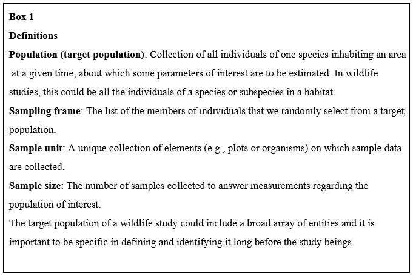
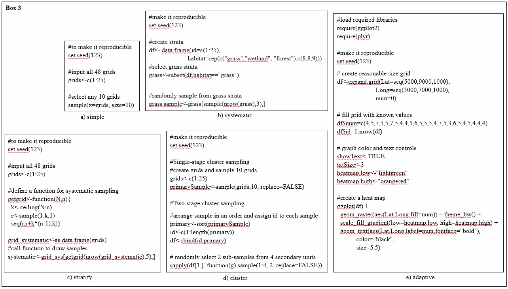

## Figures {.page_break_before}

{#fig:openworkflow-diagram}

<!--Reference this figure in text like this (Figure @fig:openworkflow-diagram).-->

![Example study designs distributing experimental (E) and control (C) study plots across patches varying in habitat quality. High-quality patches are green while low-quality plots are blue. Study designs differ in how they control for extraneous envrionmental variation: not accounting for envrionmental variation (A), accounting for environmental variation by restricting the effects to a single level of habitat quality (B), or accounting for environmental variation through blocking across levels of habitat quality (C).](images/BlockingFigure.png){#fig:blocking}

<!--Reference this figure in text like this (Figure @fig:blocking).-->

{#fig:Rcode}

<!--Reference this figure in text like this (Figure @fig:Rcode).-->

{#fig:Rcode2}

<!--Reference this figure in text like this (Figure @fig:Rcode2).-->

{#fig:Box6.1}

<!--Reference this figure in text like this (Figure @fig:Box6.1).-->

{#fig:Fig6.1}

<!--Reference this figure in text like this (Figure @fig:Fig6.1).-->

{#fig:Fig6.2}

<!--Reference this figure in text like this (Figure @fig:Fig6.2).-->

{#fig:Fig6.3}

<!--Reference this figure in text like this (Figure @fig:Fig6.3).-->

{fig:fig6.4}

<!--Reference this figure in text like this (Figure @fig:Fig6.4).-->

## Tables
