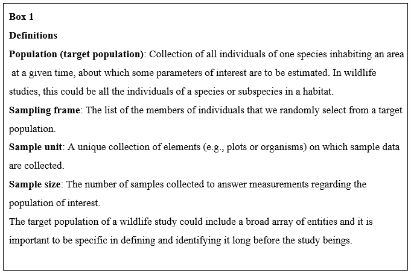
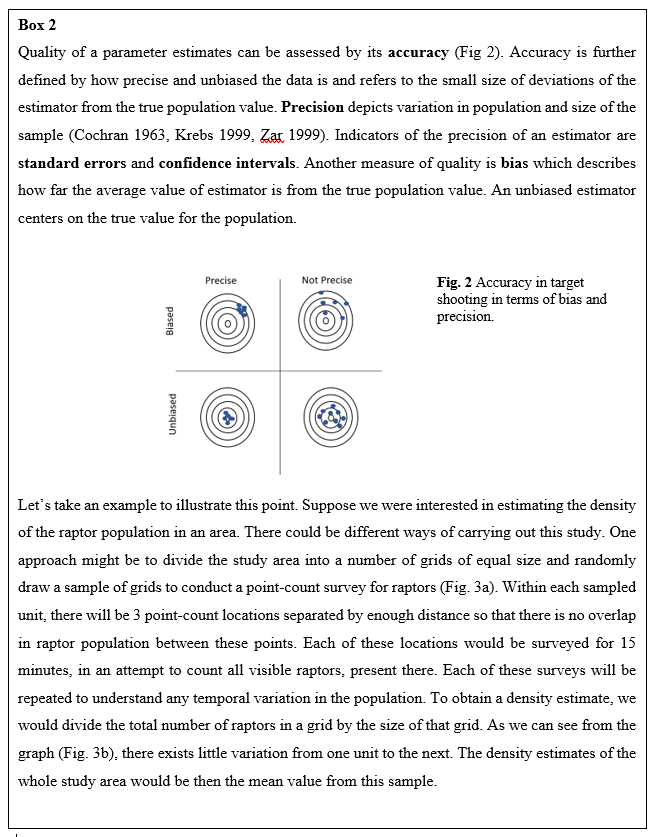
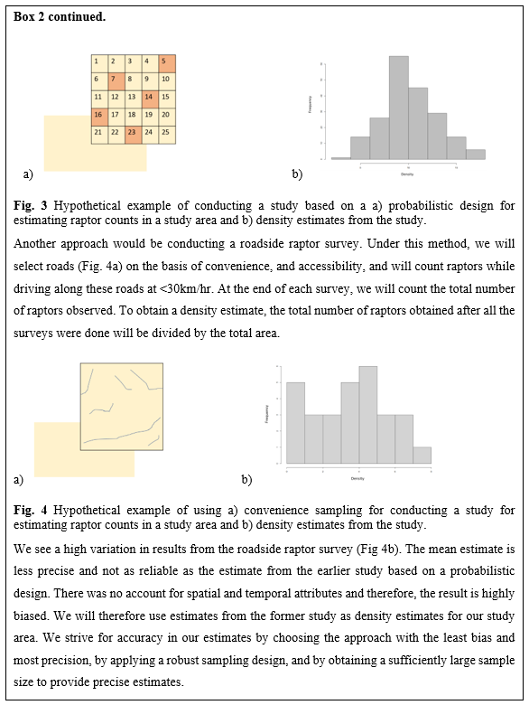
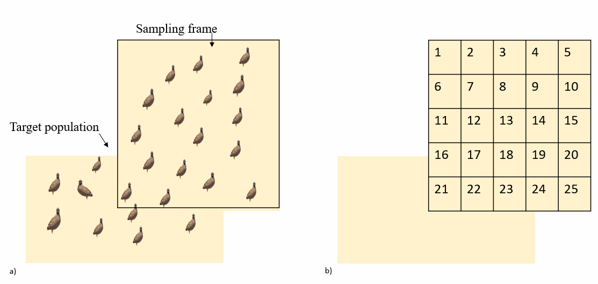
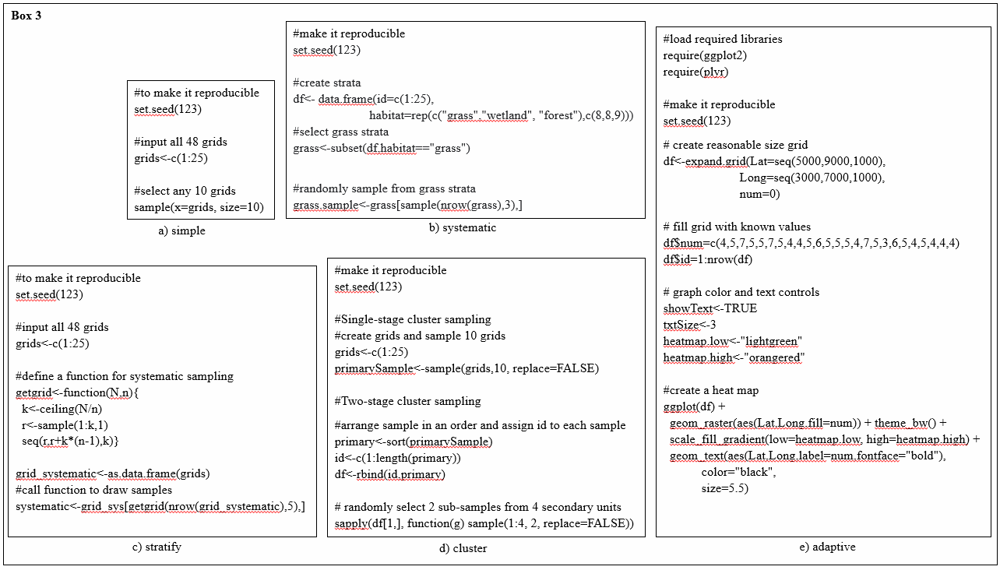

---
title: 'Chapter 1: Management, Research and Experimental Design'
keywords:
- wildlife
- publishing
- open science
lang: en-US
date-meta: '2023-06-30'
author-meta:
- James Martin
- Matthew J. Grainger
- Victoria Nolan
- William B. Lewis
- Erlend B. Nilsen
- Sprih Harsh
- Chloé R. Nater
header-includes: |-
  <!--
  Manubot generated metadata rendered from header-includes-template.html.
  Suggest improvements at https://github.com/manubot/manubot/blob/main/manubot/process/header-includes-template.html
  -->
  <meta name="dc.format" content="text/html" />
  <meta name="dc.title" content="Chapter 1: Management, Research and Experimental Design" />
  <meta name="citation_title" content="Chapter 1: Management, Research and Experimental Design" />
  <meta property="og:title" content="Chapter 1: Management, Research and Experimental Design" />
  <meta property="twitter:title" content="Chapter 1: Management, Research and Experimental Design" />
  <meta name="dc.date" content="2023-06-30" />
  <meta name="citation_publication_date" content="2023-06-30" />
  <meta name="dc.language" content="en-US" />
  <meta name="citation_language" content="en-US" />
  <meta name="dc.relation.ispartof" content="Manubot" />
  <meta name="dc.publisher" content="Manubot" />
  <meta name="citation_journal_title" content="Manubot" />
  <meta name="citation_technical_report_institution" content="Manubot" />
  <meta name="citation_author" content="James Martin" />
  <meta name="citation_author_institution" content="Warnell School of Forestry and Natural Resources, University of Georgia, 180 E. Green Street, Athens GA" />
  <meta name="citation_author_orcid" content="0000-0001-8937-2262" />
  <meta name="twitter:creator" content="@gamebirddoc" />
  <meta name="citation_author" content="Matthew J. Grainger" />
  <meta name="citation_author_institution" content="Terrestrial Biodiversity, Norwegian Institute for Nature Research - NINA, Postbox 5685 Torgarden, 7485 Trondheim, Norway" />
  <meta name="citation_author_orcid" content="0000-0001-8426-6495" />
  <meta name="twitter:creator" content="@Ed_pheasant" />
  <meta name="citation_author" content="Victoria Nolan" />
  <meta name="citation_author_institution" content="Warnell School of Forestry and Natural Resources, University of Georgia, 180 E. Green Street, Athens GA" />
  <meta name="citation_author_orcid" content="0000-0002-6069-963X" />
  <meta name="twitter:creator" content="@victoria_nolan1" />
  <meta name="citation_author" content="William B. Lewis" />
  <meta name="citation_author_institution" content="Warnell School of Forestry and Natural Resources, University of Georgia, 180 E. Green Street, Athens GA" />
  <meta name="citation_author_orcid" content="0000-0003-4978-6027" />
  <meta name="twitter:creator" content="@None" />
  <meta name="citation_author" content="Erlend B. Nilsen" />
  <meta name="citation_author_institution" content="Terrestrial Biodiversity, Norwegian Institute for Nature Research - NINA, Postbox 5685 Torgarden, 7485 Trondheim, Norway" />
  <meta name="citation_author_orcid" content="0000-0002-5119-8331" />
  <meta name="twitter:creator" content="@eb_nilsen" />
  <meta name="citation_author" content="Sprih Harsh" />
  <meta name="citation_author_institution" content="Warnell School of Forestry and Natural Resources, University of Georgia, 180 E. Green Street, Athens GA" />
  <meta name="citation_author_orcid" content="0000-0002-6462-7668" />
  <meta name="citation_author" content="Chloé R. Nater" />
  <meta name="citation_author_institution" content="Terrestrial Biodiversity, Norwegian Institute for Nature Research - NINA, Postbox 5685 Torgarden, 7485 Trondheim, Norway" />
  <meta name="citation_author_orcid" content="0000-0002-7975-0108" />
  <meta name="twitter:creator" content="@chloe_nater" />
  <link rel="canonical" href="https://DrMattG.github.io/TechBk1/" />
  <meta property="og:url" content="https://DrMattG.github.io/TechBk1/" />
  <meta property="twitter:url" content="https://DrMattG.github.io/TechBk1/" />
  <meta name="citation_fulltext_html_url" content="https://DrMattG.github.io/TechBk1/" />
  <meta name="citation_pdf_url" content="https://DrMattG.github.io/TechBk1/manuscript.pdf" />
  <link rel="alternate" type="application/pdf" href="https://DrMattG.github.io/TechBk1/manuscript.pdf" />
  <link rel="alternate" type="text/html" href="https://DrMattG.github.io/TechBk1/v/b98444018f5468ff263609c5c79b15ca2b0f95b2/" />
  <meta name="manubot_html_url_versioned" content="https://DrMattG.github.io/TechBk1/v/b98444018f5468ff263609c5c79b15ca2b0f95b2/" />
  <meta name="manubot_pdf_url_versioned" content="https://DrMattG.github.io/TechBk1/v/b98444018f5468ff263609c5c79b15ca2b0f95b2/manuscript.pdf" />
  <meta property="og:type" content="article" />
  <meta property="twitter:card" content="summary_large_image" />
  <link rel="icon" type="image/png" sizes="192x192" href="https://manubot.org/favicon-192x192.png" />
  <link rel="mask-icon" href="https://manubot.org/safari-pinned-tab.svg" color="#ad1457" />
  <meta name="theme-color" content="#ad1457" />
  <!-- end Manubot generated metadata -->
bibliography:
- content/manual-references.json
manubot-output-bibliography: output/references.json
manubot-output-citekeys: output/citations.tsv
manubot-requests-cache-path: ci/cache/requests-cache
manubot-clear-requests-cache: false
...

<small><em>
This manuscript
([permalink](https://DrMattG.github.io/TechBk1/v/b98444018f5468ff263609c5c79b15ca2b0f95b2/))
was automatically generated
from [DrMattG/TechBk1@b984440](https://github.com/DrMattG/TechBk1/tree/b98444018f5468ff263609c5c79b15ca2b0f95b2)
on June 30, 2023.
</em></small>

## Authors

+ **James Martin**
   
    {.inline_icon width=16 height=16}
    [0000-0001-8937-2262](https://orcid.org/0000-0001-8937-2262)
    · {.inline_icon width=16 height=16}
    [quaildoc](https://github.com/quaildoc)
    · {.inline_icon width=16 height=16}
    [gamebirddoc](https://twitter.com/gamebirddoc) 
  <small>
     Warnell School of Forestry and Natural Resources, University of Georgia, 180 E. Green Street, Athens GA
  </small>

+ **Matthew J. Grainger**
   
    {.inline_icon width=16 height=16}
    [0000-0001-8426-6495](https://orcid.org/0000-0001-8426-6495)
    · {.inline_icon width=16 height=16}
    [DrMattG](https://github.com/DrMattG)
    · {.inline_icon width=16 height=16}
    [Ed_pheasant](https://twitter.com/Ed_pheasant) 
  <small>
     Terrestrial Biodiversity, Norwegian Institute for Nature Research - NINA, Postbox 5685 Torgarden, 7485 Trondheim, Norway
  </small>

+ **Victoria Nolan**
   
    {.inline_icon width=16 height=16}
    [0000-0002-6069-963X](https://orcid.org/0000-0002-6069-963X)
    · {.inline_icon width=16 height=16}
    [victorianolan8](https://github.com/victorianolan8)
    · {.inline_icon width=16 height=16}
    [victoria_nolan1](https://twitter.com/victoria_nolan1) 
  <small>
     Warnell School of Forestry and Natural Resources, University of Georgia, 180 E. Green Street, Athens GA
  </small>

+ **William B. Lewis**
   
    {.inline_icon width=16 height=16}
    [0000-0003-4978-6027](https://orcid.org/0000-0003-4978-6027)
    · {.inline_icon width=16 height=16}
    [wblewis7](https://github.com/wblewis7) 
  <small>
     Warnell School of Forestry and Natural Resources, University of Georgia, 180 E. Green Street, Athens GA
  </small>

+ **Erlend B. Nilsen**
   
    {.inline_icon width=16 height=16}
    [0000-0002-5119-8331](https://orcid.org/0000-0002-5119-8331)
    · {.inline_icon width=16 height=16}
    [ErlendNilsen](https://github.com/ErlendNilsen)
    · {.inline_icon width=16 height=16}
    [eb_nilsen](https://twitter.com/eb_nilsen) 
  <small>
     Terrestrial Biodiversity, Norwegian Institute for Nature Research - NINA, Postbox 5685 Torgarden, 7485 Trondheim, Norway
  </small>

+ **Sprih Harsh**
   
    {.inline_icon width=16 height=16}
    [0000-0002-6462-7668](https://orcid.org/0000-0002-6462-7668)
    · {.inline_icon width=16 height=16}
    [spharsh](https://github.com/spharsh) 
  <small>
     Warnell School of Forestry and Natural Resources, University of Georgia, 180 E. Green Street, Athens GA
  </small>

+ **Chloé R. Nater**
   
    {.inline_icon width=16 height=16}
    [0000-0002-7975-0108](https://orcid.org/0000-0002-7975-0108)
    · {.inline_icon width=16 height=16}
    [ChloeRN](https://github.com/ChloeRN)
    · {.inline_icon width=16 height=16}
    [chloe_nater](https://twitter.com/chloe_nater) 
  <small>
     Terrestrial Biodiversity, Norwegian Institute for Nature Research - NINA, Postbox 5685 Torgarden, 7485 Trondheim, Norway
  </small>

::: {#correspondence}
✉ — Correspondence possible via [GitHub Issues](https://github.com/DrMattG/TechBk1/issues)

:::

## Introduction

<!-- Leader: James A. Martin -->

### What is wildlife science and management? 

<!--Add references using [@doi:]
If no doi then add to the manual-references.json file -->

### Seeking truth 

### Uncertainty 

### Environmental variation 

### Linguistic uncertainty 

### Partial observability 

### Partial controllability 

### Structural uncertainty 

## Opening the Gates of Management and Science 

<!-- Leader: Chloe Nater; co-leaders: Matt Grainger, and Erlend Nilsen -->

<!--Add references using [@doi:]
If no doi then add to the manual-references.json file -->

### Openness to diversity of knowledge 

Wildlife research and management are closely entwined fields with a large number of different stakeholders. Not only that, but the stakeholders typically represent a highly diverse group of actors with complimentary knowledge and expertise relevant to the wildlife systems and/or management challenges at hand [@doi:10.1890/ES12-00415.1]. 
This diversity of knowledge can be illustrated through the -- admittedly very vague -- concept of "expert knowledge".  
In the eyes of the general public it may be the **researchers** that come to mind first when thinking about "experts" [@doi:10.1177/0963662519852038; @{https://www.pewresearch.org/science/2019/08/02/trust-and-mistrust-in-americans-views-of-scientific-experts/}]. Researchers collect and analyze data in order to provide a (quantitative) knowledge base for decision-making. Modern science is becoming increasingly more collaborative and typically involves teams of researchers with different and complimentary skills and backgrounds [@doi:10.1016/j.tree.2006.02.007; @doi:10.1890/120370; @doi:10.1890/130001]. 
At the same time, there is a growing awareness in the scientific community of the need for interdisciplinary work that also makes use of what is often termed "expert knowledge" in scientific work [@doi:10.1016/j.jenvman.2018.04.025; @doi:10.3897/rethinkingecology.6.64103].  
When used by a researcher, the term "expert" often refers to any non-researcher who possesses valuable knowledge (in the context of a study/problem). In wildlife research, this typically encompasses managers and citizen scientists, and sometimes also includes indigenous people. 
**Wildlife managers**, occasionally also referred to as "end users", "decision makers", or "policy makers", are aware of the practical contexts framing wildlife research and often have a good grasp of both logistical and financial implications of different types of monitoring and management strategies and interventions [@doi:10.1016/j.jenvman.2018.04.025]. They may also possess a wealth of (qualitative) knowledge about focal species and ecosystems, as well as about motivations and interests of various other stakeholders in a system [@doi:10.1890/ES12-00415.1; @doi:10.1016/j.jenvman.2018.04.025].  
Some **citizen scientists** (sometimes also called "community scientists") may possess similar knowledge, at least about the former, based on experiences from their extensive time spent observing, enjoying, and collecting data on species [@doi:10.1890/110278; @doi:10.1016/j.biocon.2016.05.015]. They may also have a good understanding of potential issues and challenges with data collection in the field [@doi:10.1890/110278]. Last but not least, citizen scientists represent a portion of the general public, and may contribute to debates and decision-making with viewpoints, priorities, and values that are central to a large number of people [@doi:10.1016/j.biocon.2016.05.015; @doi:10.1111/csp2.376].  
**Indigenous people** have been living as part of and interacting with the natural environment since long before scientific research as we know it today was conducted [@doi:10.4324/9780203123843]. As a consequence, indigenous communities hold intricate knowledge about their lands and waters which is tightly linked to their culture [@doi:10.1002/fee.2435] and which often covers time spans necessary for understanding long-term ecological changes [e.g. @doi:10.1038/nclimate2958]. Indigenous knowledge is, in many ways, complementary to ecological science and the involvement of indigenous people can lead to more impactful, effective, and just research and management [@doi:10.1038/s41559-018-0706-0].  
Notably, individuals may also belong to several of the categories introduced above. Wildlife managers, for example, may be actively doing research (or have done so in the past) and may also be collecting citizen science data in their free time. Indigenous people may hold central roles in conservation decision making. Some researchers may have indigenous backgrounds, etc. If anything, that only further enhances the diversity of knowledge surrounding wildlife research and management.

### Engagement of diverse stakeholders 

Harnessing and making optimal use of the diversity of available knowledge surrounding wildlife and wildlife management requires broad involvement of different stakeholder groups [e.g. @doi:10.3897/rethinkingecology.6.64103]. Collaboration is key, and this necessitates that the entire process -- from data collection to policy implementation -- is inclusive. Four principles form the basis of inclusivity in this context:  openness, accessbility, transparency, and reproducibility. These principles are also the corner stones of open science [@doi:10.1890/ES14-00402.1; @doi:10.1002/eap.1822; @doi:10.1016/j.techfore.2020.120037].
**Open** processes are clearly visible and offer opportunities for anyone to engage with them and contribute. **Accessible** processes are set up and documented in a way that allows everyone to obtain information relevant to them and be able to understand both the information itself and the way it was generated. **Transparent** processes feature complete documentation of every step of the workflow (this includes data collection, analysis, and presentation but also resulting decision-making) and provide all materials that informed and are produced by them. Finally, the mark of **reproducible** processes is that they are provided as complete workflows and based on tools that everyone can access, meaning that anyone (possessing relevant knowledge) can re-run the workflow and arrive at the same conclusions. 
Robust decision-making based on diverse knowledge thus requires workflows that are open, accessible, transparent, and reproducible and the next section provides and overview over the components of such workflows (Figure @fig:openworkflow-diagram). 

### Open and accessible workflows

When considering research workflows, we often only think of the steps connecting data and results. However, complete workflows in wildife research and management begin with planning and implementation of monitoring and end with reporting, decision making, and evaluation. Knowledge is built incrementally, and workflows should therefore also be thought of as cycles where newly gained information and results from evaluation feed back into earlier steps (e.g. sensu adaptive management, @doi:10.1016/j.jenvman.2010.10.041; @doi:10.1111/1365-2664.12406). 

 

Figure @fig:openworkflow-diagram gives an overview over the main components of open and accessible workflows.  

{#fig:openworkflow-diagram}

 

It starts with data collection and hence with **monitoring protocols**, which should be openly accessible and documented in a way that they can be understood and -- in theory -- re-produced/re-implemented by independent parties.  
The outcome of monitoring is recorded **raw data**, which should be made available publicly if possible and ideally adhere to FAIR (*F*indabilty, *A*ccessibility, *I*nteroperability, *R*eusability) and/or CARE (*C*ollective benefit, *A*uthority to control, *R*esponsibility, and *E*thics) data principles [@doi:10.1038/sdata.2016.18; @doi:10.5334/dsj-2020-043; @doi:10.1038/s41597-021-00892-0]. Data needs to be supplemented with appropriate and standardized **metadata** to communicate both the structure and content of the data itself, and how it has been generated (i.e. how it is linked to the monitoring protocol).  
The process to get from raw data to results typically consists of several steps, e.g. data cleaning, data wrangling/reformatting, data analysis, visualization of results, etc. These steps are implemented using some sort of **code** (manual steps, such as data editing/reformatting in Excel, are best avoided). All code should be well documented, reproducible, and version controlled [see @{https://www.britishecologicalsociety.org/wp-content/uploads/2017/12/guide-to-reproducible-code.pdf} for a guide] and made available via an appropriate repository such as GitHub, GitLab, etc. Formal code review, as is common in e.g. software development, is also a great tool to enhance reproducibility and overall quality of code [@doi:10.32942/X2CG64].  
Under ideal circumstances, both the **software** used for running code (analyses) and the **hardware** on which it is run should be open. For software, this means that the underlying code is open-source and that the program is -- ideally -- free to use. Defining openness for hardware is trickier, not least because the term spans a large variety of tech ranging from simple field loggers to sophisticated super-computers. These are typically not "publicly available", but what is crucial in the context of open and transparent workflows is that it is clearly stated what hardware was used and -- if applicable -- how one may get access to it.  
The results from data analysis, their interpretation, and potentially recommendations resulting thereof are presented in **reports**. Whether these take the shape of institutional written reports, scientific articles, oral presentations for different interest groups or any combination of them: they hold important information that should be accessible to anyone interested.  
While a majority of written reports nowadays are open access and dissemination presentations often are public events, the same cannot be said of most **decision making** processes. It is not rare for decisions in wildlife management to be made by a small number of individuals behind closed doors. That in itself does not need to be problematic, and may, in many cases, be the most efficient approach to reaching a conclusion and deciding on action. What is important for openness of and trust in wildlife management, however, is that there is an accessible record documenting the decision-making process. That way, anyone interested may gain insights into how and based on what evidence and factors decisions were made.  
This is also crucial for the final step of the workflow: **evaluation**. Thoroughly evaluating the different steps of the workflow, from the design of the monitoring to the implementation of management actions and policy, is crucial for improving outcomes and maximizing value for money in the long run.  
Finally, it is important to be aware that open scientific and management practices require appropriate **infrastructure**. This includes -- but is not limited to -- databases and repositories for storing and sharing data, code, and documents. Relevant infrastructure may be institutional or global, as long as it is accessible, endorses standardized formats, and provides both permanent identifiers and version control.  

Wildlife research and management need to be open and accessible to harness the diversity of knowledge available, which in term is crucial to tackle current and future challenges. Open and accessible workflows, from planning of monitoring to evaluation of decisions and actions (Figure @fig:openworkflow-diagram), are key to achieving that. Changing practices towards that goal will happen both through adaptation by current researchers and managers, and by teaching the next generation. Successes and failures in setting up and operating with open workflows provide examples that can be used in **education** and help equipping tomorrow's researchers and managers with the skills they need for successful wildlife management and conservation in a rapidly changing world.  

## Basics of Management/Decision Science

<!-- Leader: James A. Martin; co-leaders: Erlend Nilsen, and Matt Grainger -->

<!--Add references using [@doi:]
If no doi then add to the manual-references.json file -->

### Value of Information 

### Evidence 

### PrOACT 

### Management Strategy Evaluation 

### Adaptive Resource Management 

## Causation and Inference 

<!--  Leader: Erlend Nilsen; co-leaders: Chloé Nater and Matt Grainger, and James Martin -->

<!--Add references using [@doi:]
If no doi then add to the manual-references.json file -->

### Asking the right questions in the right way

#### Estimation questions 

#### Hypothesis driven research 

#### Exploratory research 

### Causation and correlation 

#### Sufficient causation 

#### Necessary causation 

### Manipulative Experiments 

### Observational Studies 

#### Directed Acyclic Graphs (DAGs) 

#### Confounding variables 

#### Mediator and moderating variables 

## Basics of Robust Experimental Design 

<!-- Leader: Will Lewis; co-leaders: James Martin -->
<!--Add references using [@doi:]
If no doi then add to the manual-references.json file -->

Researchers must carefully consider the design of their study before
initiating experiments or collecting observational data. After
formulating a hypothesis, researchers should answer the following
questions: what type of data will need to be collected to assess the
hypothesis, what are the spatial and temporal dimensions of the study,
what treatments (if any) will be used and how will they be applied, how
will study areas or individual animals be selected for study, what
sample sizes will be required, what are the potential sources of error
which could affect the data collection process, how can these potential
sources of error be accounted for, and what are the appropriate
statistical methods for analyzing the data. The process of experimental
design is critical for ensuring that inferences generated from the
collected data will properly assess hypotheses. Inappropriate
statistical methods are relatively easy to rectify if the study design
and data collection are sound; however, there may be little that can be
done statistically to rectify a flawed study design. After designing
your study, solicit review from peers with expert knowledge of your
methods or study system. Consulting a statistician when designing a
study may also be helpful. Soliciting advice and review from experts can
help to improve the design of a study and rectify any overlooked
methodological issues before data collection starts. During this
process, researchers should carefully consider the three cornerstones of
experimental design [@doi:10.2307/3802926]: 1) Randomization, 2) Replication,
and 3) Controls.

### Randomization

Randomly assigning treatments to units is a fundamental cornerstone of
experimental studies. Indeed, it is the ability of the researcher to
randomly assign treatments that separates experimental studies from
observational studies. Randomly applying treatments to units is
important for preventing conscious or unconscious researcher bias from
affecting the results. Imagine a study testing the hypothesis that
providing corn at feeding stations will increase overwinter survival of
eastern gray squirrels (*Sciurus carolinensis*). We have 20 study plots
available, 10 of which will be continuously supplemented with dried corn
throughout the winter while the other 10 will not. Some study plots are
far off the road and require a substantial hike through the woods to
reach, while others are situated along the road. Because carrying bags
of corn through the woods is difficult, we decide to supplement corn at
the 10 plots nearest to roads. The problem with this design is that we
have introduced bias by selecting experimental plots nearest to the
roads instead of at random. Squirrels living near the road may naturally
suffer higher rates of mortality from car collisions irrespective of
food abundance. Our data may actually show lower survival in treated
plots and we may erroneously conclude that corn supplementation
decreases survival of squirrels; however, these results are a
consequence of poor study design. A more appropriate design would be to
randomly select plots for food supplementation, regardless of difficulty
of access. Treatments can be randomly selected using a random number
table or random number generator, which are widely available online and
are included in many software packages.

True randomization is not possible for observational studies, as
treatments cannot be applied to units. Surveying abundance of western
capercaillie (*Tetrao urogallus*) across an elevational gradient would
be an observational study because researchers cannot randomly assign
some locations to be at a high elevation and some to be at a low
elevation. This is not to say that randomization is unimportant for
observational studies; other aspects of randomization can be
incorporated into the design of both observational and experimental
studies to reduce bias. We may not be able to randomly assign the
elevation of potential study locations in the grouse example; however,
if we have a pool of potential survey areas at high and low elevations,
we could randomly select a subset of study locations within each
elevation band.

### Replication

Replication is the process of conducting experimental manipulations or
observations on multiple, independent units. Appropriate levels of
replication must be enacted within all combinations of treatment groups
(or other explanatory variables) relevant to the research hypotheses.
For example, if a researcher is interested in studying the interaction
between food supplementation and predator removal on population growth
rates of northern bobwhites (*Colinus virginianus*), they would need to
establish multiple study plots for each of the four combinations of food
and predator control treatments (food supplemented/predators removed, no
food supplemented/predators removed, food supplemented/no predators
removed, no food supplemented/no predators removed). Replication is an
essential component of both experimental and observational studies for
several reasons. Replication allows researchers to assess the variance
among units within a treatment group, which is a prerequisite for all
statistical analyses. Moreover, replication reduces the effects of
random chance on the response variable. Researchers are generally not
able to measure every individual in a population, or every potential
study area across the landscape. Instead,researchers generally sample a
subset of the available units and use the measurements from this subset
to estimate the mean of the entire population. Environmental systems are
complex and variable over space, time, and between individuals, so
single observations may represent unusual outcomes rather than the
population mean. Imagine that we are interested in estimating the
juvenile survival and sources of fawn mortality for a mule deer
population (*Odocoileus hemionus*) and we deploy a radiocollar on a
single fawn. If we found that this fawn was killed by a predator, we
would not conclude that all fawns in this population are killed by
predators. If instead we collared 100 fawns and found that 55 survived,
31 were killed by predators, 6 were killed by vehicle collisions, and 8
died from starvation or disease, the higher number of replicates would
allow us to more confidently conclude that our results are
representative of the actual population values.

Increasing the number of replicates will increase the precision of
population estimates; however, increasing the sample size comes with
increased costs and effort. An important question when designing
experiments is then: what is the sufficient level of replication that
balances precision of estimates with the cost and effort of conducting
the study? The minimum sample size will vary by study, though it may be
estimated by performing a prospective power analysis during the design
phase. Power analyses estimate can estimate the minimum required sample
size for a study based on two parameters: 1) the desired or expected
magnitude of the difference between treatment groups, and 2) the
expected variance between units within treatment group. See [@url:https://ag.arizona.edu/~steidl/files/pdfs/Steidl%202001%20IWMC.pdf] for a detailed description of power analyses. The
question, then, is how to estimate the expected variance and difference
between treatment groups before collecting any data. Researchers can use
estimates derived from published literature in a similar study system
with the same or similar species. For example, researchers designing a
study on the effects of predator removal on the survival of northern
bobwhites in Iowa may be able to estimate the minimum number of
radiotransmitters to deploy based on published estimates of the variance
and survival of bobwhites in high-predator and low-predator habitats
from Georgia. If time and funds are sufficient, researchers could also
perform a small-scale test of the methods and data-collection procedures
before the main study. These pilot studies are valuable for power
analyses, as they collect preliminary data on the group means and
variance that are likely to be observed in the main study. In addition
to informing prospective power analyses, pilot studies also allow
researchers to assess the feasibility of the study design and identify
previously-overlooked methodological issues before the main study
commences.

<!-- **Comment: I tried to keep the discussion of the power analyses simple here so I omitted discussing type I and II error rates (since those are set by the researcher in the design phase). I could bring them up, but would require a much more in-depth discussion. Are error rates brought up anywhere else? Also, I could add a section discussing how retrospective power analyses are not really valid, though this would require discussion of power.** -->

Though replication is imperative in scientific studies, researchers must
be careful to avoid pseudoreplication. True experimental replicates are
independent of each other; however, pseudoreplication occurs when
measurements which are not independent are treated as independent in
statistical analyses [@doi:10.2307/1942661]. The consequences of
pseudoreplication include overestimating precision and falsely
concluding that there is a treatment effect when there is none [@doi:10.2307/2265754]. Preventing pseudoreplication requires correctly
identifying the experimental unit of a study, which is the lowest
experimental level in which units are independent from others. The
experimental unit is the level at which the treatment is applied in
experimental studies, though care must be taken when identifying the
experimental unit in studies with multiple levels of treatments. Imagine
a study where different herbicides are sprayed on a series of forest
patches, and 4 study plots are established within each patch. Each study
plot is then selectively logged at a different thinning rate. The logged
plots within each forest are not independent, as they are exposed to the
same broad herbicide application. The individual forest patches are the
experimental unit of analysis while the logged plots are considered
subunits. Importantly, increasing the number of subunits will not
increase the levels of replication nor the statistical power of a study;
replication is increased only by increasing the number of experimental
units.

In some cases, non-independence between observations may be readily
apparent. The locations of individual bison (*Bison bison*) in the same
herd would clearly not be independent of one another, and treating them
as independent would constitute pseudoreplication. In other cases,
pseudoreplication may be less obvious. Imagine that we are designing a
study to assess the effects of selective logging on the body mass of
ruffed grouse (*Bonasa umbellus*). We identify a forest stand which has
recently been logged and a forest stand which has not been logged, and
in each stand we capture and weigh 30 grouse. We find that the average
mass of the 30 grouse in the logged stand is 377 g and the average mass
of the 30 grouse in the logged stand is 363 g. Doing a t-test with a
sample size of 30 for each treatment, we get a p-value of 0.03 and
conclude that grouse are heavier in selectively-logged stands. The issue
is that, even though we weighed 60 grouse, the treatment (presence or
absence of logging) is applied at the level of the forest stand. Grouse
within a stand are exposed to the same logging application and so are
not independent. The individual forest stands are the experimental units
of analysis while individual grouse are subunits. Even though we have
measured 60 grouse, we only have one forest stand in each treatment. We
have no replication at the level of the experimental unit, and applying
a statistical analysis is inappropriate. We have vastly overestimated
our sample size by treating each of the 60 grouse as independent.
Capturing and weighing more grouse in each patch will not help to
resolve this issue; the only way to increase the number of replicates is
expand our study area to weigh grouse in more logged and unlogged
stands. An appropriate method to avoid pseudoreplication would be to
identify 10 stands which have been recently logged at similar thinning
rates and 10 stands which have not been logged. In each one, we capture
and weigh 30 grouse. We then average the weights across grouse in each
stand to get a single weight value for each experimental unit. We can
then perform a t-test between the average weights of grouse in the 10
logged stands and the 10 unlogged stands.

Though subunits should not be treated as independent replicates,
increasing the number of subunit measurements provides other benefits
for statistical analyses. Sometimes, the variance within experimental
units is of direct interest for studies, e.g., assessing how the
variation in grouse weight rather than mean weight differs between
logged and unlogged stands. In this case, measuring multiple subunits
within each experimental unit would be required to estimate variance.
Taking repeat measurements within experimental units also helps to
reduce stochastic error and more accurately estimate the mean response
in the experimental unit. If we had only captured and weighed one grouse
in each forest stand there is no guarantee that the bird would represent
the population mean; the single grouse may be very light or very heavy.
Measuring 30 birds at each site, however, would likely lead to more
accurate estimates of the stand-level average. The important distinction
to remember is that increasing the number of subunits may increase the
accuracy of measurements within an experimental unit but does not
increase the number of replicates or statistical power.

Replication may be not be feasible in some cases, especially when
assessing hypotheses over broad temporal or spatial scales. Researchers
studying ecosystem-level processes, for example, may often be limited to
a single ecosystem due to the difficulty and cost associated with
manipulating and studying entire ecosystems. In other cases, a study may
be planned to asses the effects of some future development or treatment.
If a dam is scheduled to be built along a river, researchers may assess
the ecological effects of the dam by surveying the fish community before
the dam is constructed and then re-surveying the community after
construction has finished. Similar before/after fish surveying should
also occur in a nearby river which has not been dammed; this will help
assess if changes in the fish community are due to the dam or due to
other sources of variation (i.e., increased pollution from the
surrounding area, introduction of invasive species, etc.). This
experimental protocol is referred to as a BACI design (before-after,
control-impact) and can be a powerful method for assessing the effects
of a single treatment [@doi:10.2307/2657220]; however, it is
inherently unreplicated. There is only one dammed river, and it is
obviously unfeasible to dam more rivers to try to increase the number of
replicates. This lack of replication does not imply that ecosystem-level
or BACI studies are not informative; in fact, unreplicated studies may
be highly valuable and are often the only way to study large, complex,
or difficult-to-manipulate systems [@doi:10.2307/1942661; @doi:10.2307/3802926]. The
important point is that researchers must be careful about generalizing
results from an unreplicated study [@doi:10.2307/1942661]. The results from the
BACI study described above may show that the fish community changed
after dam construction, but the results apply only to the effects of
that particular dam. Without replication, there is no way of assessing
if the results from this particular dam are reflective of general
effects of dams on fish communities.

### Controls

The word “control” can apply to multiple different topics in
experimental design [@doi:10.2307/3802926]. One of the most common uses is to
refer to a control treatment, which is an experimental unit that has
either received no treatment or a sham treatment. Proper control
treatments are a critical component of experiments, as they provide a
baseline value with which to compare results from experimental
treatments. If we are interested in determining how vegetation cover
affects nest success of common pheasants (*Phasianus colchicus*), we
could locate 30 nests, remove 50% of the vegetation within 2 m of the
nest, and monitor nest success. We may find that the success rate of
these manipulated nests is 7% (95% confidence intervals ranging from 4 –
24%), but this value is uninformative on its own. Maybe pheasants
normally only fledge 7% of their nests, and our manipulations had little
effect. In order to discriminate the treatment effect, we need a control
treatment to determine the baseline nest success in this population. If
we monitor an additional 40 unmanipulated nests and find that the nest
success of these control nests is 40% (95% confidence intervals ranging
from 26 – 56%), we can determine that reducing vegetation cover
decreased nest success. Observational studies cannot have true control
treatments; instead, inferences are drawn by assessing how the response
variable is affected by variation in the explanatory factors. For
example, a resource selection study may compare the vegetation
composition and structure between locations used by radio-collared deer
and locations in nearby unused areas. Similarly, a researcher could
estimate the survival of adult northern bobwhites in patches which vary
in hawk density to assess the effects of hawk predation on bobwhite
survival.

Proper inferences depend on control and experimental treatments
differing ONLY in the experimental variable of interest. An
unmanipulated treatment may therefore not serve as an appropriate
control. Suppose we are concerned that the the added weight from
deploying radiotransmitters on breeding female black-throated blue
warblers (*Setophaga caerulescens*) increases stress and causes them to
abandon their nests. The most reliable way to catch and deploy
transmitters on breeding females of this species is to locate their
nests, place a mist-net nearby, and flush them off their nest into the
net. We perform a study locating 50 nests and randomly assign 25 to the
experimental treatment. We then go out to these experimental nests, set
up a net, flush the female, and attach a transmitter to her. For the 25
control nests, we continue monitoring the nests but otherwise do not
manipulate them. We find that females abandonment occurred at 6 of the
25 experimental nests but only 1 of the 25 control nests, so we conclude
that transmitter deployment increases rates of nest abandonment. This
conclusion is problematic because our control treatment differed from
the experimental treatment in more than one way: experimental females
were fitted with transmitters AND were flushed off their nests,
captured, and handled by the researchers. The increased nest abandonment
rates could have been due to attaching transmitters; however, the
increased rate of nest abandonment could also be due to the disturbance
around the nest. There is no way to separate these possible effects
under the current study design. A more appropriate control treatment,
capturing and handling females at all nests but only deploying
transmitters at experimental nests, would allow for discrimination
between these two potential mechanisms. Similarly, an appropriate
control for a food-supplementation study would be to establish and
periodically visit feeding trays in both experimental and control plots,
but only supply food at the experimental trays. This type of control
would allow researchers to discriminate between the actual treatment
effect and any inadvertent effects related to carrying out the
experiment (e.g., human disturbance, neophobia, etc.). When designing a
control treatment, researchers should endeavor to keep the experimental
methods as similar as possible between experimental and control units so
that only the factor of interest varies.

The word “control” can also refer to mitigating the effects of
extraneous variation on the study results. Extraneous variables are
those that affect the response variable but are not the main variable or
variables of interest. Imagine that we wish to assess insecticide
spraying affects the body condition of a forest-dwelling insectivorous
songbird: the red-eyed vireo (*Vireo olivaceus*). Our study takes place
in a heterogeneous landscape with forest patches surrounded by
non-forest (@fig:blocking). 

![Example study designs distributing experimental (E) and control (C) study plots across patches varying in habitat quality. High-quality patches are green while low-quality plots are blue. Study designs differ in how they control for extraneous envrionmental variation: not accounting for envrionmental variation (A), accounting for environmental variation by restricting the effects to a single level of habitat quality (B), or accounting for environmental variation through blocking across levels of habitat quality (C).](images/BlockingFigure.png){#fig:blocking}

We identify 28 study plots scattered among the 8 forest patches, 14 of which we randomly assign to the experimental group and 14 of which we randomly assign to the control group. We fly a helicopter over each study plot, spraying insecticides over experimental plots and water over control plots. We capture and weigh vireos in every study plot two weeks after spraying. We then calculate the average vireo mass for each plot. This study design incorporates randomization,replication, and an appropriate control treatment; however, many
environmental variables may affect the body mass of vireos besides just
the insecticide treatment. Maybe some forest patches are lower-quality
habitat for vireos than are others (naturally lower food levels, higher
predator density, sub-optimal vegetation, etc.). In this case, vireos in
poor-quality habitats might be expected to have lower body mass than
birds in high-quality habitats regardless of the insecticide treatment.
If we do not account for this confounding variable, then we may find
that the majority of control or treatment plots are located in
poor-quality habitats just by random chance (@fig:blocking A). This would
lead us to erroneously conclude that insecticide application does not
affect vireo mass (@fig:Rcode A) simply because the effect of the
insecticide treatment is conflated with the effect of habitat quality.
Researchers must always consider potential sources of extraneous
variation and how these can be controlled for when designing studies.

Sources of extraneous variation can be controlled for statistically or
through modifications of the study design. In the vireo example, the
extraneous effect of habitat quality could be removed from analysis by
modifying the study design to only sample in either high-quality or
low-quality habitats (@fig:blocking, @fig:Rcode). This method of
restricted sampling may be impractical in many cases, especially if the
number of possible sampling locations is small relative to the number of
confounding environmental gradients. Extraneous variables may also be
controlled through a process called blocking, wherein experimental units
are grouped into relatively homogeneous units. If we think that patches
differ in habitat quality, and these differences may introduce
extraneous variation into our analysis, we can treat each forest patch
as a “block” and distribute control and experimental treatments randomly
within each block (@fig:blocking). Distributing control and experimental
treatments evenly across blocks ensures that the effect of the block on
the response variable is evenly distributed across treatments. Moreover,
we can account for the variation introduced by the block during
statistical analyses. Including habitat quality as a covariate in the
statistical model allows us to separately estimate the effects of
insecticide application and habitat quality on vireo mass (@fig:Rcode),
thereby leading us to correctly conclude that insecticide use has an
effect on vireo body mass.

### Box 5.1 {#Rcode}

 

Blocking is not just valuable for experimental studies, but should be
carefully considered when designing observational studies as well.
Imagine a study surveying clearcut and mature forest patches in
mountainous areas to determine how the abundance of rabbits is affected
by logging. We may reasonably expect that rabbit abundance will vary
with elevation in this study. We could incorporate blocking to control
for this extraneous variation during the design phase of the study; for
example, by pairing each clearcut patch with a nearby mature forest
patch of similar elevation. Implementing a blocked study design is a
powerful method of accounting for known or hypothesized confounding
variables in both experimental and observational studies, but can also
help guard against extraneous variation from unforeseen environmental
variation [@doi:10.2307/1942661].

Not all sources of extraneous variation can be easily controlled for
through modifications of the study design, but many of these may be
controlled for during statistical analyses. If we are studying the
effects of age on late-winter survival of mourning doves (*Zenaida
macroura*), we may capture doves in the summer, age them as either
juveniles or adults based on plumage characteristics, deploy
radiotransmitters, and track them throughout the late-summer to
determine survival rates. Survival is likely to dependent on multiple
environmental factors besides age; for example, survival may also be
positively correlated with body size and local food abundance. We could
attempt to control for these sources of extraneous variation by blocking
doves into different levels of food abundance and size classes, though
it may be difficult and costly to catch and track enough juvenile and
adult doves in each food/size class to provide adequate replication.
Food availability and size are also continuous variables, so it is more
appropriate to treat them as such in the analyses. In contrast to
blocking designs, these continuous extraneous variables can easily be
controlled for in statistical models (Box 5.2). Similarly, the
probability of detecting individuals during a survey is often dependent
on environmental conditions. When performing avian point counts, for
example, the probability of birds singing and being detected by
observers can depend on factors such as the time of day, precipitation,
temperature, wind speed, and background noise. Careful experimental
design may reduce some of this extraneous variation (only doing surveys
in the morning, not doing surveys in heavy rain or wind); however,
blocking or performing all surveys under the exact same environmental
conditions is clearly infeasible. Statistical control during analyses is
needed to account for these environmental variables. Researchers may not
always known *a priori* all environmental gradients affecting the
response variable; therefore, it is good practice when collecting data
to record as much information about environmental conditions as
possible. It is generally better to collect extra data that ultimately
is not used then it is to collect insufficient data and end up regret it
later.

### Box 5.2 {#Rcode2}

 

## Sampling
<!--Add references using [@doi:]
If no doi then add to the manual-references.json file -->

The ecological question often revolves around measuring relevant biological variables (survival, density, etc.) on items (like populations, species, subspecies, etc.) of interest in the system under study. In these questions, researchers conduct studies to obtain accurate estimates of characteristics that are important for management and conservation decisions. A vast amount of literature on the subject of **sampling or finite population sampling** (@cochran1963) exists to help researchers in planning these studies.

The set of all possible individuals from which processes and patterns are to be deduced is called the **target population**. Rarely in any ecological studies, a census of the population is possible. Even in the case of rare and critically endangered species (less in number) or the case of immobile organisms like plants, collecting data from the whole population can be impossible. Thus, in most cases, researchers study a **subset of the population (sample)** and use collected information to draw inferences about the target population. The sample therefore can be described as a group of individuals who participate in research and represent the whole population. In more scientific terms, a sample is a subset of a population randomly selected based on some probabilistic design. In ecological studies, we often hear the term **sampling frame (or study area)**. To efficiently design these studies, it is necessary to understand what this term means. It is a finite set of all individuals that could be measured, and we can use different sampling schemes to obtain items from this frame. The sampling frame usually coincides with the target population, but reasons like accessibility, logistics, budget, etc. can make it differ otherwise. From this sampling frame, we draw a subset or sample of individuals, the **sampling units**, and the items to be measured for different biological variables. Sampling units should be distinct and easy to define (Box 1, Fig. 1). Target population does not always mean the number of animals. It can also be described in terms of geographic area, in which case, the sampling unit would be grids or township or county depending on the research question.

Sampling is a critical part of both descriptive and experimental studies. All field studies require appropriate sampling designs to reduce variation among observations in the study. The choice of sampling method will depend on the objectives of the study, the distribution, and characteristics of the population being sampled among many other factors.

 {#fig:Box6.1} 

{#fig:Fig6.1}

### Probability and non-probability sampling methods

For a sample to correctly represent a population, we need to properly identify the target population, followed by identifying the sampling frame, sampling units, and sampling technique. We should also be cautious about resource availability-manpower, logistics, time, etc. So, the next question here is how to draw a sample. There are mainly two types of sampling methods: probability and non-probability sampling. These designs differ in terms of the quality of parameter estimates (Box 2).

**Probability sampling**: In the probability sampling scheme, every unit from the sampling frame has a non-zero probability of selection. It, therefore, leads to unbiased estimates of the mean and variance for the variable of interest. Therefore, any method aimed at generalizing results drawn by a sample to the whole population of interest must be based on probability sampling.

**Non-probability sampling**: In non-probability sampling, researchers select samples based on their convenience. In other words, the researchers purposively choose particular units for constituting a sample. Social researchers often use this sampling design to select households or families to conduct their surveys. A few common techniques are **convenience sampling** and **judgment sampling**. In convenience sampling, samples are chosen based on an arbitrary selection procedure. It is often justified based on accessibility and availability of resources like time, budget, etc. In wildlife studies, this sampling scheme is often used for conducting roadside bird surveys, surveys for identifying mammal tracks near roads, etc. Since the location of the target species decides the sampling frame and number of samples, the results from these studies are often highly biased and far from accurate. In judgment sampling, sampling frame, and samples are chosen based on expert knowledge of the system. One common example from wildlife studies is selecting and classifying **study area (sampling frame)** into low-quality and high-quality based on expert knowledge about the area.

There are pros and cons for each of these sampling designs. Probability sampling helps in reducing sample bias and therefore provides an accurate representation of the population. Non-probability sampling is useful when we still need some preliminary data within time and budget constraints.

{#fig:Box6.2a}

{#fig:Box6.2b}

### Sampling designs under the probability sampling method

Although simple random sampling is the most basic technique for sample selection, there are others that are often used in wildlife ecology studies. There are pros and cons associated with each of these designs and they can also be combined to provide a larger set of options for study designs.

**Simple random**: Simple random sampling is the process of selecting n units from a population of N units such that every unit has an equal probability of inclusion in the sample. Simple random sampling requires that each sample unit be selected independently of all other units. This method should be used if the area of interest is homogeneous with respect to the elements and characteristics of interest. A simple random sample may be obtained by following basic steps: 1) the study area must be completely covered by non-overlapping sampling units, 2) the population of sampling units is assumed to be finite, 3) sampling units can be located and the measurement of the characteristic of interest on the unit is possible. Also, the error in measuring should be small compared to the differences in the attribute from unit to unit, and 4) sample units are sampled without replacement. For example, suppose a farmer is interested in evaluating the health of his cattle, and each of them is ear tagged. So, under simple random sampling, he can generate some random number using a calculator or excel sheet and select those tagged cattle for health assessment.

**Systematic**: Systematic sampling is the process where sampling units are selected at regular intervals. Under this sampling technique, the sampling frame will be partitioned into n number of primary units and then the selection of units will occur in a systematic fashion based on a random start. This design is easier to execute than simple random sampling. In the above example of assessing cattle health, systematic sampling will be easier to implement in case the cattle are not ear-tagged. Then under systematic design, the farmer can choose every nth cow while they are entering the barn (assuming they follow a queue). Systematic sampling is commonly used to sample vegetation characteristics. For example, determining vegetation characteristics every 10 meters along a line transect in a plot is a classical example of systematic sampling. Systematic sampling has also been criticized in cases when the arrangement of units may follow some pattern in the response variable. For example, let's say we were interested in the number of people using public areas for birding. We decided to establish a check station and take a count using a systematic sample of days during the study period. This could give us a biased result if every sampled day fell on a work week, then the estimates obtained would be very different from estimates obtained from the weekend count.

**Stratified**: In wildlife studies, populations tend to be aggregated or clustered, thus sample units closer to each other will be more likely to be similar. For this reason, systematic sampling tends to overestimate the variance of parameter estimates. A uniform grid of points or parallel lines may not encounter rare units. To increase the likelihood of capturing some of these rare units, scientists may stratify the sample such that all units of each distinct type are joined together into strata and simple random samples are drawn from each stratum. Stratified sampling is, therefore, generally used when the population from which the sample is to be drawn does not belong to one homogeneous group and there is a high variation within the population. If, however, the population belongs to a heterogeneous group, the estimates based on earlier sampling designs will be imprecise. If we have prior information associated with the heterogeneity in the population, we can use designs like stratified sampling to select samples which will increase estimates precision. This sampling technique divides the whole population into different mutually exclusive groups (strata) according to some characteristics such as the habitat they inhabit, gender, etc. Ideally, the strata should be homogeneous with respect to the variable of interest (like density, abundance, etc.). This process requires more effort than random sampling but is generally more accurate in terms of representing the population. There is also a limit to the number of strata into which a population can be subdivided. The stratified sampling method is common in wildlife studies, as it helps estimate and contrast parameters among strata. The formal procedure of stratified sampling follows a few steps: 1) specify strata, which must be mutually exclusive, 2) classify all sampling units into their stratum, and 3) draw a simple random sample from each stratum.

**Cluster**: A probabilistic sampling scheme in which each sampling unit is a cluster of items such as the group of animals. Cluster sampling is generally used in cases when there are predefined groups within the population. These groups can be based on demographics, habitats, geography, etc. The sampling process starts by dividing the population into small groups known as clusters followed by random selection of these clusters to create a sample. This approach has wide applications in wildlife study as many birds and mammals occur in groups during or all parts of the year. Cluster sampling is useful when the cost or time to travel from one sample unit to the next is too high. Cluster sampling can also be performed in stages. Single-stage cluster sampling happens when all the elements of the chosen clusters are included in the sample. Two-stage cluster sampling is when in contrast to single-stage cluster sampling only some units are observed. The formal procedure of cluster sampling follows a few steps: 1) specify appropriate clusters and make a list of all clusters, 2) draw a simple random sample of clusters, and 3) measure all elements of interest in each selected cluster.

**Adaptive sampling**: In various studies, numerous sampling designs are combined under an adaptive sampling framework. In this technique, we start with an initial probabilistic sample of units and add more units in some pre-defined neighborhood or pre-defined condition to this sample [@thompson&saber1994, @williams2002]. This process continues until no sampled units satisfy the specified condition. Adaptive sampling offers biologists a way to augment the probability sample with samples from other units without losing the benefits of the original probabilistic design. Rules for the selection of additional samples are established based on some characteristic of the variable of interest (e.g., presence/ absence, age, sex, and height).

**Case study**: Scientists are worried that ongoing human-induced landscape changes have threatened a grouse population in eastern Wyoming, USA. They decided to conduct a study with two main objectives. They primarily want to understand the impact of this dynamic landscape on the survival of grouse and on lek numbers. The study will be done in Carbon County for a period of 3 years during which they plan to capture 150 grouse in total (both male and female; Fig 5a). For carrying out this study, they divided the study area into 25 equal-sized grids (Fig. 5b). To estimate the survival of grouse, we need to capture individuals and track them for the required time period or till they are alive, whichever comes first. We need to devise a sampling mechanism to select grids from where these grouse can be captured.

{#fig:Fig6.2}

In this case study, we will show you how researchers can sample grids using different types of probabilistic sampling schemes. Under random sampling, each of the grids will have an equal probability of getting sampled (Fig. 6a). In a systematic sampling framework, researchers can pick grids at regular intervals. So let's say, they decided to select every 5th grid starting with the 3rd grid. So, 3, 8, 13, 18, and 23 will be their plots from which the grouse will be then captured (Fig. 6b).

Suppose researchers identified three different dominant land cover types (grassland, wetland, and forest), so the random selection of grids can follow a stratified framework. Under this framework, researchers will divide the whole study area into these different strata and then randomly select grids from each of these strata to capture grouse (Fig. 6c).

Lek sites are known to be spatially close to each other. So, we would expect that if a lek is inhabiting one primary sample plot (grid), there are other leks in the neighborhood. So here researchers can use cluster sampling to calculate lek numbers. Under single-stage cluster sampling, they would start by randomly selecting primary sample plots across the study area, then within those primary plots, conduct surveys to calculate all lek numbers within the cluster of all four secondary plots (Fig. 6d). In our example, grids can act as primary plots. In each primary sample plot, there are 4 secondary sample plots (numbered 1 to 4 in some order), so under two-stage cluster sampling, we will randomly select any 2 from these 4 secondary sample plots (Fig. 6e). We will then conduct surveys to calculate lek numbers in 2 of these secondary sample plots.

Under adaptive cluster sampling, we will start with the grids which have the highest number of leks and then will sample the next grids with a similar number of grouse (Fig. 6f). See Box 3 for R codes for each of these sampling designs.

{#fig:Fig6.3}

{#fig:Fig6.4}

### Sampling methodology

In wildlife studies, there are a few commonly used sampling methodologies.

**Plots**: Plots are widely used to study habitat characteristics, vegetation characteristics, counting animal numbers, etc. Plots' shape can vary from circular to square and represents a geographically defined target population. Wildlife tends to be distributed nonrandomly across the landscape in correspondence to the distribution of their habitat. Their distributions are further impacted by intraspecific and interspecific interactions. Given that distributions and abundance vary, plots should vary in shape and size depending on the studied species. Numerous factors influence plot size, including the biology of the species, their spatial distribution, study objectives, logistical considerations, and cost constraints. For example, larger species with large home ranges require larger plots to include adequate numbers. A 3,500-ha plot might include only 10% of the home range of a grizzly bear (*Ursus arctos horribilis*), the same area could include the entire home ranges of multiple white-footed mice (*Peromyscus leucopus*). @krebs1999 listed three main approaches to determining optimal plot shape and size for a study: 1) plot size should have the highest precision for a specific study area, 3) plot size which is most accurate and efficient to answer the question of interest, and 3) plot size which is logistically easy to construct and use.

**Points**: In point sampling, a set of points is established throughout the population, and measurements are taken from each point. A common example is a point-count survey for birds where the distance to each heard or seen bird species of interest is measured from a particular point. Selection of sample points can follow any sampling design, as long as points are spaced apart enough that overlapping of the population between points is a bare minimum.

**Transects**: In line transects a line or series of lines is randomly or systematically located in the study area. Objects are recorded on either side of the line according to some rule of inclusion. The observer traverses each line, recording the perpendicular distance from the line to each detected animal. These distances are used to estimate the effective width of the area sampled by the transect. Transects can be established using any sampling design as long as each of them is treated as an independent observation and are non-overlapping.

## The Publication and Peer Review Process 
<!-- Leader: Victoria Nolan; co-leaders: Sprih Harsh --> 
<!--Add references using [@doi:]
If no doi then add to the manual-references.json file -->

Effective dissemination and communication of scientific aims, methodology and results is a crucial component of research. Publishing research findings facilitates idea development and sharing within the scientific community and to a wider wildlife audience, including landowners, conservationists and key decision makers keen to implement new research and concepts in practical ways. Much of the published research available in journals in print and online has been through the ‘peer review’ process, where a draft of the manuscript proceeds through several rounds of reviews by at least one, usually anonymous, academic research peer specializing in that particular research field [@doi:10.1002/aris.2011.1440450112]. In theory, this ensures that all peer-reviewed published research is of a high quality, has been thoroughly proof-checked and is being seen by the most appropriate and wide reaching audience possible. Nevertheless, the process of publishing and reviewing scientific research is often daunting to students and early career researchers, and there is relatively little cohesive advice or guidelines about the process, often leaving such individuals to ‘figure it out for themselves’. In this section, we aim to provide a short overview of the process, both for authors and peer-reviewers, to eliminate some of the confusion and mystery about the publication of academic research. 

### Determining coauthorship

One key thing to decide before beginning the manuscript submission process is who should be listed as an author of the paper [@doi:10.1038/508312a; @doi:10.1016/j.joi.2017.01.002]. Scientific work is rarely conducted alone, and successful, meaningful ecological research often involves large collaborative efforts between teams of researchers, conservationists, land-owners, companies, technicians and students. Thus, determining who qualifies to be listed as a co-author is not always straight-forward. Generally speaking, an un-written rule is that an individual should be listed as a co-author if they contribute to at least two crucial components of the work, which may include but are not limited to: initial study design and conceptualization, obtaining funding, project management, field or laboratory work, data collating and processing, statistical analysis and manuscript drafting or proof-reading (Rahman et al., 2017). More often now journals require an ‘Author Contribution’ statement to be added to the manuscript or the online submission form, indicating the contribution of each author to the key tasks involved in compiling the manuscript (Rennie et al., 2000) (see Box 1 for an example author contribution statement).

Another potentially controversial and confusing decision when submitting multi-authored manuscripts is in what order should the authors appear in the author list (Tscharntke et al., 2007). The first author position, receiving the most credit for the work, is generally the individual who has played the most crucial role in the work (e.g. the project lead or primary writer), with all subsequent authors listed either in order of decreasing contribution, alphabetically or in order of seniority. In some scientific fields or for particular journals, the last author position is seen as prestigiously equal to first author position and is reserved for the team leader e.g. the project manager or research principal investigator. It is important to check if the chosen journal has specific instructions about authorship contributions and order to ensure that each individual receives the appropriate credit for their work on that research project.

The final decision to make is who acts as the corresponding author (e.g. the individual who submits the final manuscript draft and is responsible for handling all correspondence with the journal and editors). Usually this is the first (or last if appropriate) author of the paper, and is the person responsible for handling all queries, revisions and approving article proofs from the journal. The corresponding author is also committed to declaring on behalf of all co-authors that there are no conflict of interests or prior publications of the work, and that all work is original and was conducted ethically (Shewan and Coats, 2010).

### Choosing the best publication outlet

Once a draft of the manuscript has been completed and authorship has been decided, there is relatively little formal guidance other than that provided by colleagues as to the most appropriate avenue and format for publication. Modern publication today occurs primarily online, with the internet facilitating easy and quick access to thousands of publications and journals worldwide. However, each journal will differ in its impact, scope, relevance, target audience, and overall publication process (Lewallen and Crane, 2010; ). In Figure X, we present a brief overview of the main steps to consider when choosing a journal, each of which can present a potential hurdle in the publication process. Following these steps will ensure minimal time is wasted for both authors and journal editors in the submission and initial review stages, and that the manuscript will be directed to the most appropriate journal with the best chance of making it to peer-review.
 
A logical approach to choosing the best publication avenue is to start by asking whether the scope of the journal (i.e. the topics and types of research published) encompass that of your work (Step 1 in Figure X). This includes determining whether the journal publishes material targeted at specific areas of interest or publishes more broadly; some journals (e.g. Global Ecology and Biogeography, Journal of Applied Ecology or PLOS One) publish on a broad range of ecological, evolutionary, environmental, or biogeographical topics, but others target specific taxa (e.g. Fungal Diversity, Mammalian Biology etc.), methods (e.g. Environmental DNA or Remote Sensing in Ecology and Conservation), concepts (Global Food Security, Nature Sustainability) or geographical areas (e.g. European Journal of Environmental Sciences, Journal of Asia-Pacific Biodiversity). Reading the aims, scope or overview of the journal, as well as checking out their recently published papers, will provide an indication of whether your manuscript is likely to be a fit for the journal, and just as importantly, whether the journals’ target audience is appropriate for your research.

If your work fits within the scope of the journal, the second step might be to see if your type of manuscript matches those that they publish (Step 2 in Figure X). Before beginning any draft manuscript it is important to decide, in collaboration with the co-authors, what type of research you are aiming to present and publish, whether that is an original research article (most common), a review or synthesis paper, technical note, letter, response to another article or perhaps even a gallery of photos or uploads of raw data. Not all types of submission will be accepted by every journal. In addition, formatting guidelines for each journal (e.g. length of manuscript, headings, citation style etc.) often differ between different types of research, so making sure your work is correctly formatted per the manuscript type will be an important step in getting your manuscript sent out quickly for peer-review.

Additionally, not all journals have equal reach in terms of the number of readers, article quality or reach, and several metrics exist for authors to compare journals. Although controversial and often confusing, the main metric widely used is the Impact Factor (IF), calculated as the average number of times articles in a journal from the past two years have been cited in relation to the total number of articles published over the same two year period (Garfield, 1999). Although only useful when comparing journals, the IF provides an idea of the quality and reach of the journal, and provides an indication how likely your work will be accepted by the journal. Other metrics include the SCImago Journal Rank (SJR), taking into account the ‘value’ of a citation and journal prestige, and the Source Normalized Impact per Paper (SNIP), which measures citation impact within a subject field (cite; cite).

A final, yet by no means insignificant factor, are the fees, usually termed the Article Processing Charges (APCs), charged to the authors by the journal to publish your work (Figure X). Journal revenues generally comes from two sources: 1) publishing charges if the article is Open Access (OA) (available for anyone to read) or 2) journal subscription fees from individuals, libraries or organizations. If the latter, usually your work is only available to those with subscription access, potentially limiting your works’ reach and accessibility. However, OA publishing fees can be substantial, so being aware early on of the sources of funding for publication is important. Some large organizations e.g. universities might have waiver agreements with the larger OA publishers like Wiley, and additional financial support might be offered for authors from developing countries or other organizations, but often funding for publication will be the responsibility of the researcher, principal investigator or research team. Make sure to clarify funding sources for publication with your funder, supervisor or department early in the research process and always check out the journal guidelines for information on fees and waivers before starting a submission. 

### Who should review your manuscript?

Obtaining feedback from colleagues and peers has been shown to be extremely valuable for producing cohesive, well-written and clear pieces of scientific writing (Paulus, 1999; Nicol et al., 2014). Right from the start of the initial design phase of a field study, experiment or piece of written work, asking for and implementing constructive criticism and recommendations at all stages in the process will massively improve the chance that your research will be successful, and will thus make a valuable contribution to the field when it comes to writing up the final manuscript for publication. Before the final manuscript submission, consider asking your supervisor, senior colleagues, peers or other collaborators not directly involved in the work, for their critical opinions throughout the whole of the research and writing process. This should help to identify and smooth out potential criticisms from the formal peer-review process, and will allow larger problems to be identified that might result in an outright manuscript rejection. 

During the actual submission process however, a journal will sometimes request or even mandate authors to suggest the names of potential peer-reviewers (Moore et al., 2011; Liang, 2018). This saves time for the editors in finding potential reviewers specialized in that field, and is therefore also beneficial for the authors in receiving a timely response to their submission. If requested to do so, have a careful think about who might be suitable to review your work; these selected individuals should have no conflict of interest with your research, and should not have been involved with any stages of work, reviewing or writing the manuscript. Sensible suggestions most likely to be accepted by an editor will most likely be individuals with a strong publication record relevant to the manuscript e.g. someone you have cited frequently in your work, or a known expert in that field. Avoid if possible individuals from the same institution or geographic area, or very highly renowned individuals who may not be able to spare time for peer-review (Eyers, 2021). Less frequently, there may also be an option to suggest peer-reviewers to avoid: these might be individuals with conflicts of interest in your work, or you might want to avoid them if they are known to be a very harsh, critical reviewer or for some other personal reason. Similar rules apply if the journal asks you to list preferred or non-preferred editors: make sure to take the time to research the individuals and their areas of expertise to make sure that your manuscript lands in the hands of the person most likely to facilitate its procession through the peer-review process. 

### How to constructively provide feedback as a reviewer?

Getting involved in the peer-review process is a crucial, rewarding component to being a successful academic or researcher. Becoming a peer-reviewer for a journal offers opportunities to be exposed to the most recent scientific developments in your field, as well as the chance to develop critical thinking skills and the ability to rapidly read and understand vast quantities of scientific literature. At the same time, journals rely heavily on having a significant bank of reviewers to help them examine large numbers of submissions to decide which are most noteworthy and suitable for publication (Lubek, 2018). In general, the expectations of a reviewer are to provide robust, in-depth feedback in a timely fashion on research within their field of expertise, in which they might reasonably consider themselves an expert or specialist. A reviewer should act professionally at all times by declaring any conflicts of interests, maintaining good communication with the editorial team and making sure all review material is kept confidential (Carter, 2008; Ramsden et al., 2014). 

Anyone can become a peer-reviewer, with the chances of being invited to review by the journal increasing generally with the number of publications and citations to your name (e.g. your academic experience and knowledge within that particular field), and the reach of your online academic research profile. However, even those with no publication experience can become reviewers, perhaps by asking for recommendation from a colleague, directly approaching the journal or editors, or volunteering to conduct peer-reviews for a senior researcher. It is now also possible to get recognition and verification for peer-review through online sites and services such as the Web of Science Reviewer Recognition Service (previously Publons), Elsevier’s Reviewer Hub or ORCID, and many subscription journals offer free temporary subscriptions to that journal as a reward. Building up your online peer-review history may then facilitate further invitations from other journals.

Once an invite is issued by the journal editor and accepted, the reviewer is able to see the full material and begin their review. Starting a review is often overwhelming, especially for first time reviewers, but there are many resources to help with this, including usually quite detailed advice from the journal online aimed at reviewers. Sometimes the journal also provides a more structured review template, consisting of a series of short question pertaining to the material to help direct the review. However, as this is not always available, we have compiled a brief step-by-step guide to carrying out a systematic review, based on online advice from three of the major academic publishers; Wiley, PLOS and ELSEVIER (Figure X2). We acknowledge that there are many different ways to carry out a good review, but we hope this schematic will provide a useful starting point for first time reviewers to help them develop their own review styles.

### Responding to reviews

Once a manuscript is submitted and has undergone an initial proofing process, the assigned journal editor will then look for suitable peer-reviewers to send the manuscript to for review. A manuscript will generally be seen by 1-3 peer-reviewers who will feedback their comments and recommendations (accept, accept with revision or reject) to the editor. The editor will then send their own comments and recommendations along with those of the reviewers back to the authors letting them know the outcome and next steps. It is rare for a paper to be accepted outright, with the most likely positive outcome either a major or minor revision depending on the number and severity of problems with the work. If this is the case, the authors then have the opportunity to respond in writing and to revise their work to be reconsidered for publication. 

A good response should generally include: 1) acknowledgement of the time and effort spent on the reviews by the editor(s) and reviewer(s), 2) specific, detailed point-by-point responses to each individual comment, and 3) clear indications of all the changes, additions and deletions made to the manuscript and supplementary materials, including the use of specific page and line number references and tracked changes in documents where possible. If a specific template is not provided by the journal, a good format for the response is a letter addressed to the assigned editor if known, or editor-in-chief of the journal as outlined in Box 2. The letter includes key identifying information for the manuscript and begins by thanking the editor and reviewers for the review before leading into addressing all general and specific responses one by one. 

When responding to each comment remember that an editor’s time is valuable and limited (most journal editors are part-time volunteers), so use language that is precise, concise and does not repeat information already in, or being added to the manuscript. To give an example, if a reviewer suggests expanding the literature review in a particular area, a good response might be: “We have added additional citations and explanation of each study at Line 239-250”. A bad response might thus be: “We did more research into this area and found this paper by AB that states this…, and we also have added this paper by CD et al. that says this…, and this one by EF supporting our argument here where we state... etc.”. All that is required is a clear response acknowledging the comment and showing if, how and where you have made changes.

One important final thing to mention is that authors actually have no obligation to carry out all or even any of the corrections if they fundamentally disagree with the comments, they are outside the scope of the work or the work has been misinterpreted or misunderstood. If so, it is perfectly acceptable to write a response clarifying why you disagree or do not wish to make the suggested change. Many students and early-career researchers often feel underqualified to disagree with a reviewer, but remember that you conducted the work and should have a good understanding of the feasibility and robustness of your methodology, and will likely have considered the limitations and scope of your study for much longer than the reviewer. If writing in disagreement, just make sure to always acknowledge the point of view of the reviewer, and always use very clear examples and cite supporting literature or other studies to back up your point of view. As with writing a peer-review (see Figure X2), always using courteous and professional language, and try to avoid sounding passive-aggressive or even aggressive, even if the reviewer is unnecessarily critical or harsh. 

### Marketing your manuscript after acceptance

The peer-review process can be lengthy depending on the number of reviewers, rounds of revision, and journal popularity, and it is not unusual for several months to even a year to pass between first submission and final acceptance and publication. However, most journals have online tracking systems to keep you up to date with the status of your manuscript (e.g. under review, pending decision, accepted etc.), and in the meantime it is important to think about how you wish to promote your work once it is published. As mentioned previously, it is not just the scientific community who will be interested in your work, and your findings may have broad ecological or conservation applications. Knowing how and where to communicate your research to the broader community will likely involve the use of other platforms including online social media, research collation sites and more mainstream media outlets. 

Having an established, professional social media presence on platforms such as Twitter, LinkedIn, Facebook and Instagram to name but a few, facilitates immediate, free marketing of your work, and provides easy links and ways for others to share things they find interesting. Consider how to effectively use relevant images, videos, short captions, hash-tags and handles of your co-authors to spread the broad message of your research to your target audience. Other more research specific online platforms such as Research Gate and ORCID allow for you to collate and update your publication and peer-review record, and provides ways to follow and connect with other fellow researchers in your field. You may also wish to collaborate with the advertising or marketing department within your company or academic institution to create a more general press release to traditional media outlets (radio, TV, magazines, newspapers etc.); this type of promotion can dramatically increase the reach of your work and lead to many more opportunities to disseminate your work to those that will be best to practically implement it. Planning ahead and preparing the appropriate materials to assist with your research promotion alongside your co-authors will be key to successfully making the most of these strategies. Remember that a lot of work (often years!) will have gone into designing, conducting and writing up this research, so it is important that it, and all the authors and other collaborators, get the recognition they deserve!

### References

- Allen, L., Scott, J., Brand, A., Hlava, M., Altman, M., 2014. Publishing: Credit where credit is due. Nature 508, 312–313. 
- Bornmann, L., 2011. Scientific peer review. Annu. Rev. Inf. Sci. Technol. 45, 197–245.
- Carter, V.K., 2008. Five Steps to Becoming a Better Peer Reviewer. Coll. Teach. 56, 85–88. 
- Eyers, C.E., 2021. “What’s in a Name?”: Considerations for Identifying Preferred Reviewers. J. Proteome Res. 20, 4625–4626. 
- Garfield, E., 1999. Journal impact factor: a brief review. CMAJ 161, 979–980.
- Lewallen, L.P., Crane, P.B., 2010. Choosing a Publication Venue. J. Prof. Nurs. 26, 250–254. 
- Liang, Y., 2018. Should authors suggest reviewers? A comparative study of the performance of author-suggested and editor-selected reviewers at a biological journal. Learn. Publ. 31, 216–221. 
- Lubek, J., 2018. The important role of the peer reviewer. Oral Surg. Oral Med. Oral Pathol. Oral Radiol. 125, 391–392. 
- Moore, J.L., Neilson, E.G., Siegel, V., Nephrology, on behalf of the A.E. at the J. of the A.S. of, 2011. Effect of Recommendations from Reviewers Suggested or Excluded by Authors. J. Am. Soc. Nephrol. 22, 1598–1602. 
- Nicol, D., Thomson, A., Breslin, C., 2014. Rethinking feedback practices in higher education: a peer review perspective. Assess. Eval. High. Educ. 39, 102–122. 
- Paulus, T.M., 1999. The effect of peer and teacher feedback on student writing. J. Second Lang. Writ. 8, 265–289. 
- Rahman, M.T., Regenstein, J.M., Kassim, N.L.A., Haque, N., 2017. The need to quantify authors’ relative intellectual contributions in a multi-author paper. J. Informetr. 11, 275–281. 
- Ramsden, V.R., Pimlott, N., Woollard, R., Kvern, B., Handford, C., Dunikowski, L., Gagnon, S., Hoffart, K., Ladouceur, R., Lambert, Y., 2014. Becoming a peer reviewer: Engaging in sharing and gaining knowledge. Can. Fam. Physician 60, 1158–1160.
- Rennie, D., Flanagin, A., Yank, V., 2000. The Contributions of Authors. JAMA 284, 89–91. 
- Shewan, L.G., Coats, A.J.S., 2010. Ethics in the authorship and publishing of scientific articles. Int. J. Cardiol. 144, 1–2. 
- Tscharntke, T., Hochberg, M.E., Rand, T.A., Resh, V.H., Krauss, J., 2007. Author Sequence and Credit for Contributions in Multiauthored Publications. PLOS Biol. 5, e18. 

### Other Useful Links

- https://authorservices.wiley.com/Reviewers/journal-reviewers/how-to-perform-a-peer-review/step-by-step-guide-to-reviewing-a-manuscript.html 
- https://plos.org/resource/how-to-write-a-peer-review/ 
- https://www.elsevier.com/reviewers/how-to-review 

## Figures {.page_break_before}

{#fig:openworkflow-diagram}

<!--Reference this figure in text like this (Figure @fig:openworkflow-diagram).-->

![Example study designs distributing experimental (E) and control (C) study plots across patches varying in habitat quality. High-quality patches are green while low-quality plots are blue. Study designs differ in how they control for extraneous envrionmental variation: not accounting for envrionmental variation (A), accounting for environmental variation by restricting the effects to a single level of habitat quality (B), or accounting for environmental variation through blocking across levels of habitat quality (C).](images/BlockingFigure.png){#fig:blocking}

<!--Reference this figure in text like this (Figure @fig:blocking).-->

{#fig:Rcode}

<!--Reference this figure in text like this (Figure @fig:Rcode).-->

{#fig:Rcode2}

<!--Reference this figure in text like this (Figure @fig:Rcode2).-->

{#fig:Box6.1}

<!--Reference this figure in text like this (Figure @fig:Box6.1).-->

{#fig:Fig6.1}

<!--Reference this figure in text like this (Figure @fig:Fig6.1).-->

{#fig:Fig6.2}

<!--Reference this figure in text like this (Figure @fig:Fig6.2).-->

{#fig:Fig6.3}

<!--Reference this figure in text like this (Figure @fig:Fig6.3).-->

<!--Reference this figure in text like this (Figure @fig:Fig6.4).-->

## Tables

## References {.page_break_before}

<!-- Explicitly insert bibliography here -->

